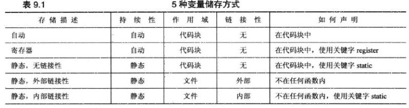
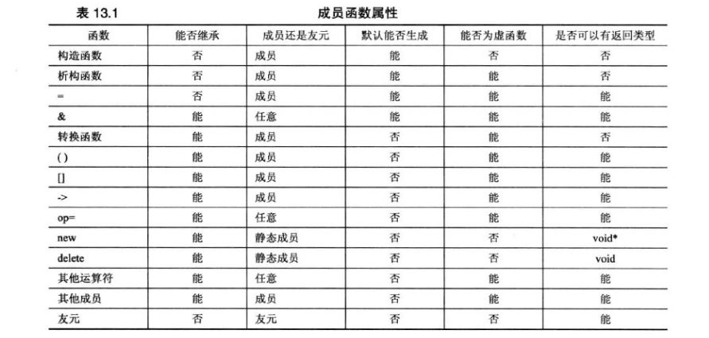

# 热点问题

- C++封装继承多态 面向对象 [链接](https://www.cnblogs.com/qianqiannian/p/6037520.html)
- 构造函数、析构函数与虚函数
- python 与c++的区别：申明类型、动态编译
- new 和 malloc 的区别：new 对象，间接内存，返回对应类型的指针； malloc 内存，返回void *，需要强制转换。[link](https://blog.csdn.net/nie19940803/article/details/76358673)
- C++空类中含有哪些默认函数？（默认构造函数、析构函数、拷贝构造函数、赋值运算符、取址运算符）[链接](https://www.cnblogs.com/dingou/p/11627817.html)

# C++ Primer Plus：
## 第 2 章、开始学习 C++
- C++ 函数定义：`int main(){};`
- 头文件：C++ 头文件拿掉了 .h，可能有从 C 转换而来的 cmath 类似文件，方便名称空间使用
- 名称空间：`using namespace std;` 叫做 “using 编译指令”，便于区分不同来源的相同命名方法。局部使用的方法有：`using std::cout;`。
- cin/cout 的运算符重载：`<<`
- 声明语句和变量：`int num;`
- 函数原型：声明函数的返回类型、函数接受的参数数量和类型

## 第 3 章、处理数据
- 基本整型：
  - bool
  - char/ signed/ unsigned
  - short/ unsigned：至少16位
  - int/ unsinged：至少16位, >= short
  - long/ unsinged：至少32位, >= int
  - long long/ unsigned
- 浮点类型：科学计数法存储
  - float: 通常 32 位
  - double: 通常 64 位
  - long double 
- 类型转换的安全性：能还原就是安全的。
- const 限定符：无法修改的常量，代替 C 的 #define
- auto 声明：根据赋值数值自动推断，尽量避免。

## 第 4 章、复合类型
- 三种复合类型：
  - 数组：存储多种同类型的值
  - 结构：不同类型存储于一个对象
  - 指针：存储变量的地址，声明类型指出对象的类型，解除引用算符*获得内容。
- 字符串：以空字符结尾的数组
- string
- 变量存储方式
  - 自动存储：函数调用时产生，结束时消亡
  - 静态存储：static 变量，声明周期贯穿某个子函数
  - 动态存储：手动管理
    - new / del 运算符：显式请求内存，返回指针/ 释放内存
- vector 模板类 C++98
- array 定长数组模板类 C++11

## 第 5 章、循环和关系表达式
- 循环：for, while, do while
- 关系表达式：<, <=, ==, >=, >, !=

## 第 6 章、分支语句和逻辑运算符
- 分支语句：if, if else, switch
- 逻辑运算符：&&, ||, !
- 位运算, &, |, ^异或, ~取反
- 条件运算符：?:

## 第 7 章、函数：C++ 的编程模块
- 函数的组成
  - 函数的定义：实现功能的代码
  - 函数的原型：接口描述，接受参数的个数、类型、返回的类型
- 参数传递：默认按值传递
  - 形参与实参：原型声明的接口是形参，调用实参
  - 传递复合类型：传递地址，那就存在复合类型内部数值被篡改的风险。
- [ ] 指针与 const
  - 指针指向一个常量对象：
    - 避免无意间修改数据
    - const 能处理 const 和非 const 实参，否则只能接受后者
  - 将指针本身声明为常量
- string 类型：.size() 判断字符串的长度，避免泄露问题
- 函数可递归：可以自我调用
- [ ] 函数名与函数地址：将函数地址作为参数，传递要调用函数地址的名称

## 第 8 章、函数探幽
- 内联函数 inline
  - 提高执行速度（不需要切换堆栈），内存消耗大（每一处都重新声明变量）
  - 编译器编译常规函数：让程序跳到相应代码段执行函数；
  - 编译内联函数：相应的代码替换函数调用。
  - 函数很短的时候采取内联
- 引用变量
  - 伪装指针，允许为变量创建别名，用作处理结构和类对象的函数的参数。
  - 尽可能用 const:
    - 避免无意修改的错误
    - 接受 const 和非 const 的类型
    - [ ] 使函数能正确生成并使用临时变量。
- C++ 的原型：定义默认参数值。
- 函数的特征标：手工编写多态
  - 相同函数名的不同参数列表。
  - 函数的 **多态或重载**，重载函数为不同数据类型提供相同服务。
- 函数模板：自动匹配多态
  - template \<typename T\> 覆盖多种类型，相当于正则表达式的 .
  - 自动完成重载函数的过程（也就是编译时，选择哪一种多态的实现）。
  - 编译器为特定参数类型生成正确的函数定义。

## 第 9 章、内存模型和名称空间
- 代码组织策略
  - 头文件：定义类型、提供函数原型
  - 源文件：具体函数操作
  - 执行入口：main 函数
- 变量类型与作用域
  - [ ] 代码块和函数：`{}` 包裹一层代码块。函数也有一层代码块？
  - 作用域和链接性：程序的哪一部分可以访问它
  - 自动变量：存在于代码块
  - static 静态变量：程序执行期间存在。
    - 函数外定义：文件可用（文件作用域），程序的其他文件使用（外部链接性），需要 extern 关键字的声明；
    - 函数内定义：局部作用域，无链接性，但程序执行期间一直存在。
  - 动态变量：new/delete 控制，由自由存储区或堆存储数据。
  - 总结一表 

- 函数类型与作用域
  - C++ 函数链接性默认为外部，可在文件间共享
  - static 限定的函数的链接性为内部，被限定在该文件中
- 名称空间
  - 减少名称冲突
  - [ ] 作用域解析运算符、using 声明、using 编译指令

## 第 10 章、对象和类

- OOP 编程的思想：提供方法接口、隐藏数据
- C++ 类的构成
  - 类声明：由函数原型表示的方法、数据的类型
  - 类实现：定义成员函数的源代码
  - 构造函数
  - 析构函数
- C++ 类的执行
  - 存储自己的数据，共享类的方法
  - this 指针
- 利于 ADT 的实现：abstract data type，比如栈

## 第 11 章、使用类
- 运算符**重载**：operator*op*(argument-list)：相当于 Python 内部的 \__*op*\__方法，这是一种运算符**多态**的表现。
  - [ ] 重载限制
- 友元：赋予与类的成员函数相同的访问权限。
  - example: 重载 * 运算符时，`3*B` 实际执行 `operater\*(3, B)`，需要调用 B 的成员变量，其他例子包括 `cout <<`
    - [ ] friend 的实际使用方法
    - [ ] 作为成员函数还是非成员函数
  - 友员函数：访问私有类成员，声明 friend 类型的函数
  - 友元类：
  - 友元成员函数
- [ ] 类和基本类型间的转换：C++ 如何处理用户定义类型的转换。

## 第 12 章、类和动态内存分配
- [ ] 讲类的构造/析构函数的使用问题，包括 new 导致内存分配、释放的问题、const 对象的问题。

## 第 13 章、类继承
- 可重用性
  - C 的做法：提供预定义、预编译的函数，可调用，但经常不提供源代码，或源代码复杂很难更改。
  - C++ 的做法：类继承。提供类接口，通过继承基类原有的成员变量和函数，派生出新类。
- **基类** 的 **继承**，**派生类**
  - 继承的内容：成员变量和大部分成员函数，不包括构造函数、析构函数、赋值运算符
  - 访问权限：直接访问共有成员、保护成员，通过基类的共有方法和保护方法访问私有成员。
  - 析构函数：先调用基类析构函数，再调用派生类析构函数。
  - 删除对象：先删除派生类，再删除基类。
- 设计基类
  - protected：用于继承，直接访问
  - private：用于限制，避免出错
  - virtual：重新定义基类的方法
    - 通过指针或引用访问的对象，能根据对象的类型来处理，不是根据引用或指针类型来处理。
    - 析构函数应当是虚函数。
  - example：定义抽象类Shape，只定义接口，不定义方法，用其派生出具体的形状类。则Shape 至少必须包含一个纯虚方法，在声明的分号前加 `=0`。
- **虚函数与纯虚函数**：
  - 虚函数表示继承的派生类可重新方法定义。
  - 包含纯虚函数的类，不能用来创建对象，纯虚函数只用于派生通用接口。
- 成员函数属性 
